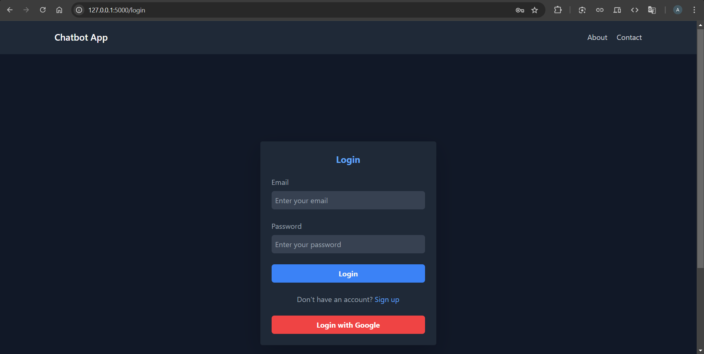
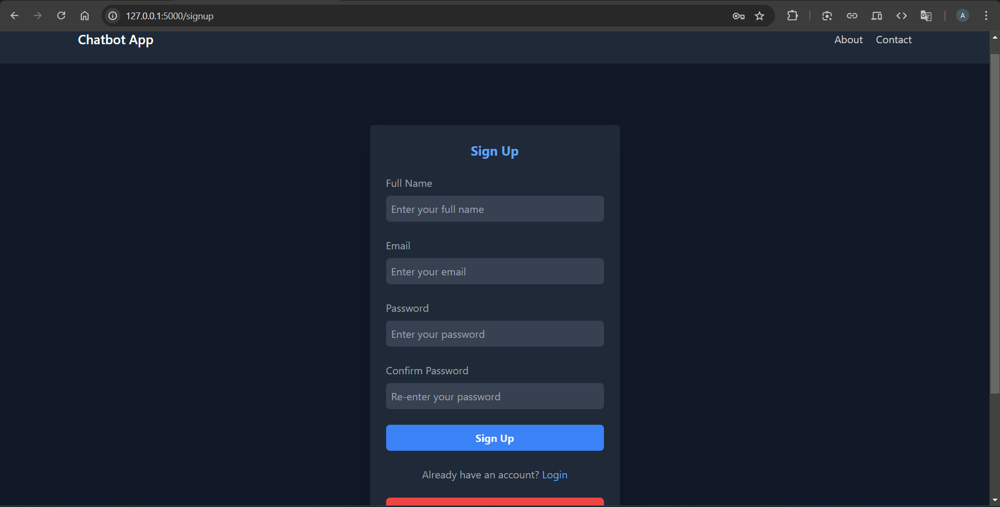
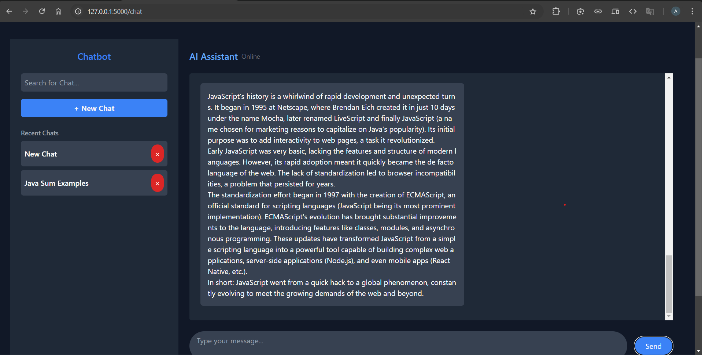

# Multi-Purpose AI Chatbot

A multi-functional chatbot powered by Google Gemini AI and Flask. Designed to assist users in various domains, from educational support and creative ideation to general queries, this chatbot offers intuitive and interactive user experiences.

---

## Table of Contents

1. [Overview](#overview)
2. [Features](#features)
3. [Technologies Used](#technologies-used)
4. [API Endpoints](#api-endpoints)
5. [Demo Screenshots](#demo-screenshots)
6. [Future Enhancements](#future-enhancements)

---

## Overview

This multi-purpose AI chatbot leverages Google Gemini AI to provide intelligent, context-aware, and creative responses. It supports user authentication, real-time conversation tracking, and persistent chat history with a dynamic and responsive interface.

---

## Features

- **AI-Powered Conversations**: Utilizes Google Gemini AI for generating intelligent and creative responses.
- **Multi-Purpose Functionality**:
  - Answer FAQs and provide topic explanations.
  - Assist with creative ideation and general queries.
- **User Authentication**:
  - Traditional signup and login with secure password hashing.
  - Support for third-party login (e.g., Google).
- **Chat Features**:
  - Start new chats with AI generated titles.
  - Save, delete, and revisit chat histories.
  - Generate concise titles for conversations using AI.
- **Secure and Persistent**:
  - User data and chat history stored securely using Flask SQLAlchemy.
  - Session management with Flask-Login.
- **Streaming Response**:
  - Stream response for better user experience.
- **Web Application**:
  - Modern and responsive interface built with Flask.

---

## Technologies Used

- **Backend**: Flask, Flask-Login, Flask-SQLAlchemy
- **Frontend**: HTML, CSS, JavaScript
- **AI Integration**: Google Gemini AI
- **Environment Variables**: Managed using `python-dotenv`

---

## API Endpoints

### User Authentication

- **POST** `/auth/login`: Authenticate and log in a user.
- **POST** `/auth/signup`: Register a new user.

### Chat Functionality

- **GET** `/chat`: Render the chat interface.
- **POST** `/chat`: Send a message and receive a response.
- **POST** `/api/new_recent`: Create a new chat with an optional title.
- **POST** `/save/title`: Save a custom title for an existing chat.
- **GET** `/api/load_chat/<recent_id>`: Load messages for a specific chat.
- **DELETE** `/api/delete_chat/<recent_id>`: Delete a chat and its associated messages.

### AI Integration

- **POST** `/generate/title`: Generate a concise title for a conversation using AI.

---

## Demo Screenshots

1. **welcome page**
   
2. **Login and Signup Pages**
   
   
3. **Chat Interface**
   
   
4. **New Chat Creation**
   
5. **AI Response Examples**
   
   

---

## Future Enhancements

- **Memory**: Enable the chatbot to remember past conversations and context.
- **Improved AI Responses**: Refine answers for better accuracy and relevance.
- **Advanced UI Features**: Add enhanced interactivity.
- **Usage Analytics**: Implement user interaction metrics for insights and improvements.

---
